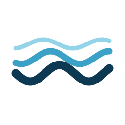

# Tides for Home Assistant

A custom component that predicts high and low tides for any location and
shows them on a minimal, animated wave card — current level, the next
high/low, and sunrise/sunset, all read off one timeline.

No API key, no subscription, no tide-station coverage limits: tides are
computed locally from Sun/Moon astronomy for whatever latitude/longitude you
give it.

## How it works

Real tide tables come from station-specific harmonic constants collected
over years of observation — there's no way to derive them from a lat/lon
alone. Instead, this integration computes the **equilibrium tide**: the
tide implied directly by the Sun and Moon's positions relative to your
location, from low-precision astronomical formulas (Meeus, *Astronomical
Algorithms*).

That's a genuine physical computation — you'll see real spring/neap cycles
and diurnal inequality — but it's an approximation. Real coastlines add a
lag ("establishment of the port") that the equilibrium tide doesn't know
about. If you know a real high-tide time for your area (from a local tide
table), set the **calibration offset** in the integration's options to shift
predictions to match it.

## Installation

### HACS (recommended)

1. HACS → ⋮ → Custom repositories → add this repo as an **Integration**
2. Install **Tides**, then restart Home Assistant

### Manual

Copy `custom_components/tides` into your Home Assistant `custom_components`
folder and restart.

## Setup

Settings → Devices & Services → Add Integration → **Tides**.

- **Name** — used as the device/card title
- **Latitude / Longitude** — defaults to your Home Assistant location

Add as many locations as you like — each is a separate config entry.

After adding, open the integration's **Configure** options to set:

- **Tidal range** — the local crest-to-trough swing in metres, used to scale
  the wave (a few tens of centimetres for the open ocean, several metres in
  places like the Bay of Fundy or the Bristol Channel)
- **Calibration offset** — minutes to shift predictions, to line up with a
  known local tide time

## The card

The integration registers `tides-card` automatically — no manual resource
step needed.

Dashboard → Edit → Add Card → search **Tides**, or in YAML:

```yaml
type: custom:tides-card
entity: sensor.home_tide
title: Home
hours_to_show: 24
show_name: true
show_current: true
show_next: true
```

| Option | Default | Description |
| --- | --- | --- |
| `entity` | *required* | A Tides sensor entity |
| `title` | entity name | Text shown in the card's header bar |
| `hours_to_show` | `24` | Width of the visible time window, in hours |
| `show_name` | `true` | Show/hide the header bar |
| `show_current` | `true` | Show/hide the current height + trend reading (top-left) |
| `show_next` | `true` | Show/hide the next high/low time (top-right) |

The card sits transparent on your dashboard's own theme. Small dots mark
each high and low on the curve, colour-coded amber/indigo dots mark
sunrise/sunset, and a ringed dot tracks the current position. Current
height and the next high/low time are the only text, each optional.

## Entity

Each location gets one sensor, state `rising` or `falling`, with attributes:

| Attribute | Description |
| --- | --- |
| `height_m` | Current predicted height (metres, relative to mean sea level) |
| `tidal_range_m` | Configured tidal range |
| `next_high` / `next_low` | `{ time, height }` for the next high and low tide |
| `previous_event` | The most recent high or low |
| `next_sunrise` / `next_sunset` | ISO timestamps |
| `curve` | Sampled `[time, height]` points the card renders — not recorded in history |

These make it straightforward to build automations, e.g. notify when the
tide is within an hour of high water.

## License

MIT — see [LICENSE](LICENSE).
